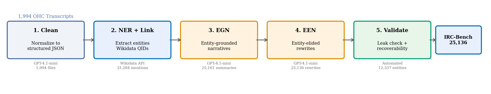
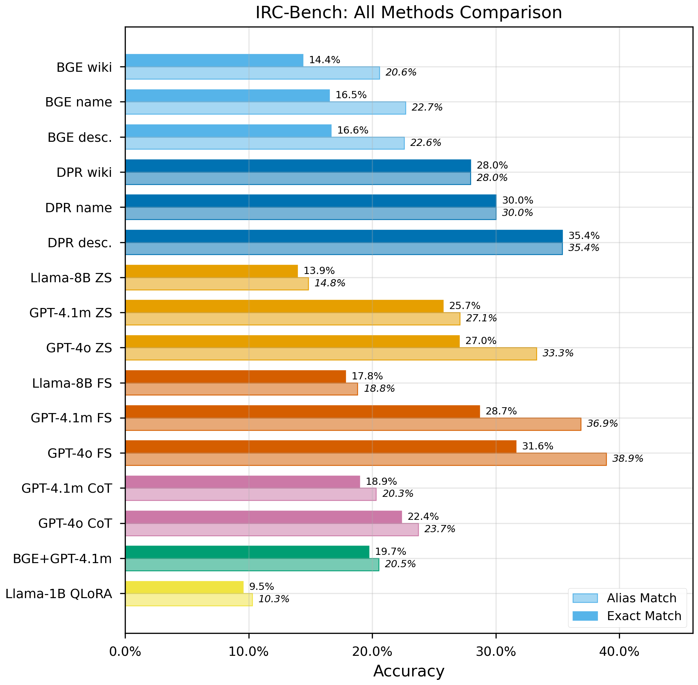
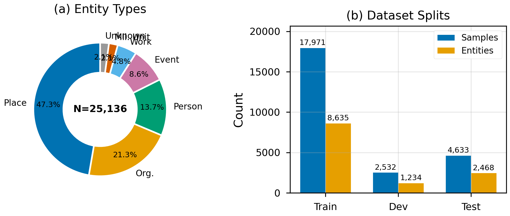

# IRC-Bench: Recognizing Entities from Contextual Cues in First-Person Reminiscences

[](https://apartsinprojects.github.io/ImplicitEntities/)

**IRC-Bench** is a benchmark for **implicit entity recognition** in reminiscence narratives. Given a first-person narrative that references a named entity through contextual cues alone (without ever naming it), the task is to identify the entity.



## Key Results

QLoRA-adapted Llama 3.1 8B achieves the highest open-world exact match at 38.94%, while fine-tuned DPR with entity descriptions reaches 42.80% alias-aware Hit@1 in the closed-world setting. Chain-of-thought prompting consistently degrades performance across all models.



## Dataset

- **25,136 samples** from 1,994 reminiscence transcripts across 11 thematic domains
- **12,337 unique Wikidata-linked entities** (Place, Organization, Person, Event, Work, Military Unit)
- **Entity-level train/dev/test splits** with zero entity overlap
- Each sample pairs an Entity-Grounded Narrative (EGN) with an Entity-Elided Narrative (EEN)



## Project Structure

```
IRC-Bench/
  data/
    benchmark/           Experiment-ready v5 splits (CSV, JSON)
      irc_bench_v5.csv   Full dataset (25,136 samples)
      entity_kb.json     Entity knowledge base (12,337 entities)
    pipeline/            4-stage construction pipeline
      transcripts/       1,994 cleaned oral history transcripts
      entities_extracted/ NER output per transcript
      summaries/         Entity-grounded narratives (explicit)
      implicit/          Entity-elided rewrites (implicit)
    source_data/         Raw transcripts organized by collection

  experiments/
    run_open_world.py    O1-O6: LLM generative (GPT-4o, GPT-4.1-mini, Llama 8B)
    run_closed_world.py  C1-C6: embedding retrieval (BGE-base, DPR fine-tuned)
    submit_phase_b.py    O11-O12: chain-of-thought, RAG1
    train_dpr.py         DPR fine-tuning (MNRL loss)
    gpu_jobs/            QLoRA training scripts (vast.ai)
    models/              Trained DPR and QLoRA model weights
    results/             All experiment predictions and metrics

  article/
    article_v4.html      Full paper (HTML)
    article_v4.docx      Full paper (Word)
    article_v4_short.html  8-page conference version (HTML)
    article_v4_short.docx  8-page conference version (Word)
    figures/             Publication-quality figures (PDF + PNG)

  docs/                  GitHub Pages (paper hosted online)
  twitter/               Archived Twitter experiment data
  archive/               Pre-v5 data, scripts, models
```

## Experiments (19 configurations)

| Paradigm | Experiments | Best Result |
|----------|------------|-------------|
| Embedding baseline | C1-C3 (BGE-base, 3 representations) | 16.6% Hit@1 |
| DPR fine-tuned | C4-C6 (3 representations) | 42.8% alias Hit@1 |
| LLM zero-shot | O1, O3, O5 (GPT-4o, GPT-4.1-mini, Llama 8B) | 33.3% alias |
| LLM few-shot | O2, O4, O6 | 38.9% alias |
| Chain-of-thought | O11/b, O12/b, O13 (with temperature control) | 33.5% alias |
| QLoRA fine-tuned | O10 (Llama 3.1 8B) | 41.4% alias |
| RAG | RAG1 (BGE + GPT-4.1-mini) | 20.5% alias |

## Quick Start

```bash
# Load the benchmark
import json
test = json.load(open("data/benchmark/irc_bench_v5_test.json"))
print(f"Test samples: {len(test)}")  # 4,633

# Each sample has:
# - implicit_text: the entity-elided narrative (input)
# - entity: the gold entity name (target)
# - entity_type: Place, Organization, Person, Event, Work, Military_Unit
# - entity_qid: Wikidata QID
```

## Citation

```bibtex
@article{apartsin2026ircbench,
  title={IRC-Bench: Recognizing Entities from Contextual Cues in First-Person Reminiscences},
  author={Apartsin, Alexander and Moran, Eden and Apartsin, Yehudit},
  year={2026}
}
```

## License

The benchmark annotations are released under CC BY-NC-SA 4.0. Source transcripts are publicly available from their respective archives (see `data/provenance/sources.json`).
